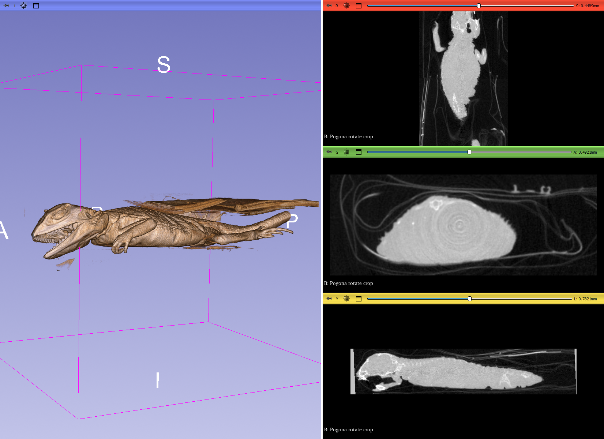

## MorphoDepot Repository
Repository for segmentation of a specimen scan.  See [this JSON file](MorphoDepotAccession.json) for specimen details.
* Species: Pogona vitticeps
* Modality: Micro CT (or synchrotron)
* Contrast: No
* Dimensions: (363, 678, 137)
* Spacing (mm): (0.11999999730000001, 0.11999999697428199, 0.11999999730000001)

## Screenshots

_Screenshot of specimen scan_
